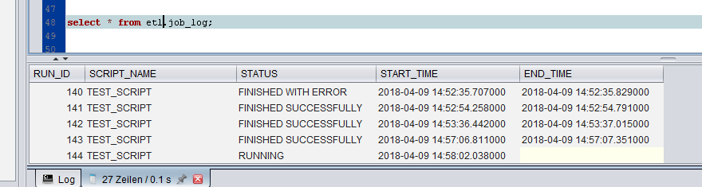
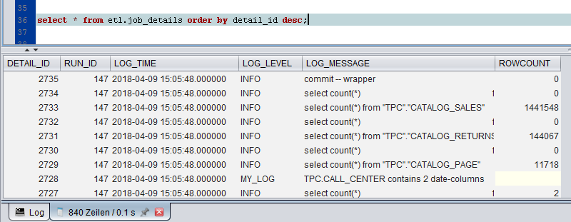

# ETL Utilities 

###### Please note that this is an open source project which is *not officially supported* by EXASOL. We will try to help you as much as possible, but can't guarantee anything since this is not an official EXASOL product.

## Query Wapper

The Query Wrapper is a lightweight object-oriented Lua script used as a library to build procedural ETL jobs in Lua.
It provides uniform handling of query parameters, errors and logging into log tables (`job_log` and `job_details`) and iterating over result sets.

### Installation

1. Execute the `query_wrapper.sql` script as a user who can create schemas, tables and scripts; `SYS` can be used for this purpose.

2. There are two table defintions embedded (as comment) in the beginning of the script. These create the standard logging tables in the `etl` schema, but the Query Wrapper can use logging tables created in any schema, thus the tables are not created automatically, giving you the opportunity to place them in a schema other than `etl`. If required, modify the schema name in these `CREATE TABLE` statements before executing these statements; otherwise just run them as they are (in EXAplus, just select the text of the statements and press `Ctrl`+`Enter`). 

3. To enable the database user that is actually used to perform the ETL processes to utilize the Query Wrapper, you need to grant this user with the neccessary privileges. The best it is done by creating a role and then grant this role to the appropriate user(s).

```sql
CREATE ROLE etl_user;

GRANT EXECUTE ON etl.query_wrapper TO etl_user;
GRANT SELECT, INSERT, UPDATE ON etl.job_log TO etl_user;
GRANT SELECT, INSERT ON etl.job_details TO etl_user;

GRANT etl_user TO <your_etl_user>;
```

### Example

The basic  example below shows how to initialize the query wrapper, iterate over a result set, setting parameters, executing queries and finishing the query wrapper in the end.

**NOTE:** If you have large tables or tables in virtual schemas then the below example might take a long time to execute. In this case, you might want to add a `WHERE` clause to the first `SELECT` statement.

```lua
CREATE OR REPLACE LUA SCRIPT etl.example_script RETURNS TABLE AS

    import('etl.query_wrapper','qw')

    wrapper = qw.new('etl.job_log', 'etl.job_details', 'test_script')

    for table_schema, table_name in wrapper:query_values([[SELECT table_schema, table_name FROM exa_all_tables]] ) do

        wrapper:set_param('SCH', quote(table_schema))	
        wrapper:set_param('TAB', quote(table_name))

        wrapper:query([[SELECT COUNT(*) FROM ::SCH.::TAB ]])
		
        -- Query whether table contains a date value
        wrapper:set_param('SCH_unquoted', table_schema)	
        wrapper:set_param('TAB_unquoted', table_name)	

        suc, res = wrapper:query([[
            SELECT COUNT(*)
            FROM   exa_all_columns
            WHERE  column_schema = :SCH_unquoted
               AND column_table  = :TAB_unquoted
               AND column_type   = 'DATE';
        ]])
        -- If table contains date value, create a custom log message
        if res[1][1] > 0 then
            wrapper:log('MY_LOG', table_schema .. '.' .. table_name .. ' contains ' .. res[1][1] .. ' date columns')
        end

    end

    return wrapper:finish()
/

EXECUTE SCRIPT etl.example_script();
```

The query wrapper from the example generates two tables:

- JOB_LOG:

<p align="center">
  
</p>

- JOB_DETAILS:

<p align="center">
  
</p>

